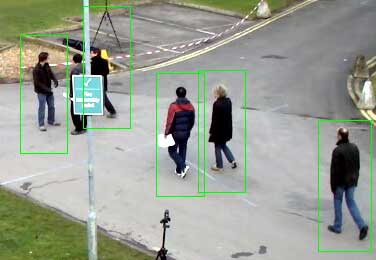

# ED22-01-Abarca-Robles

# Proyecto: Detección y reidentificación de caras en secuencias de imágenes o video
## Curso: Estructura de datos

### Integrantes

* Matías Robles (Encargado de la bitácora)
* Juan Pablo Abarca (Coordinador)

### Bitácora

[Ver Bitácora](Docs/Bitácora.md)

### Resumen

> El desafío del taller empieza con un sistema que no hemos trabajado con anterioridad, por lo cual tuvimos que hacer nuestra propia investigación más las ayudantías que se nos proporcionaron para entender sobre las bibliotecas de OpenCV en C++ un lenguaje que también empezamos a aprender este semestre.

>El código en si toma imágenes y encierra a las personas detectadas en rectángulos rojos, las cuales se le aplican centroides que van a ser trabajadas con el método HOG para ubicar donde están y donde estarán en la imagen subsecuente. Se trabajará con una línea en medio de la imagen para tener el contador de personas, donde van y su velocidad.

### Documentos

* [Reporte Técnico](Docs/README.md)

